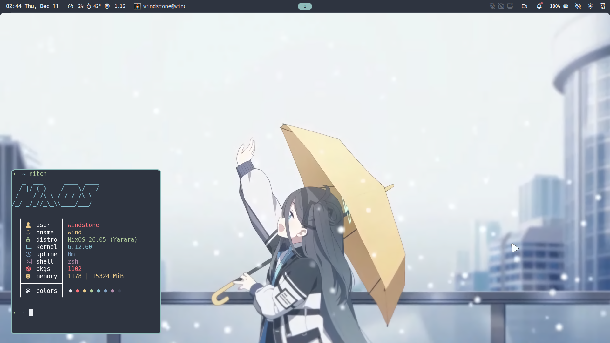

# NixOS & other configurations

I did not spent more than ten hours on this, yet I still love what results I got with almost zero nix knowledge. Final terms are stopping me from improving this configuration further :c

## Screenshots

## Tools

- Tiling Manager: Niri
- Session: Wayland
- Shell: Noctalia
- Terminal: Alacritty
- File Manager: Dolphin & Thunar
