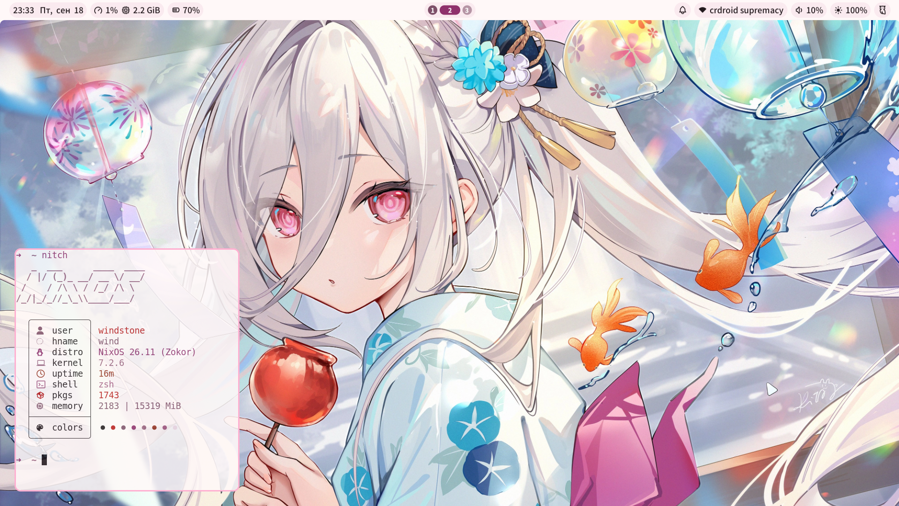
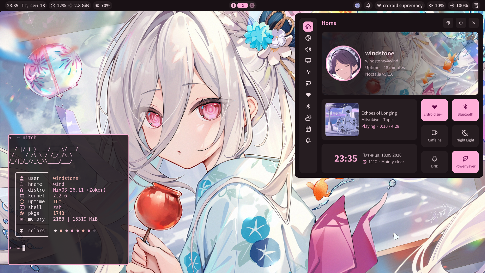
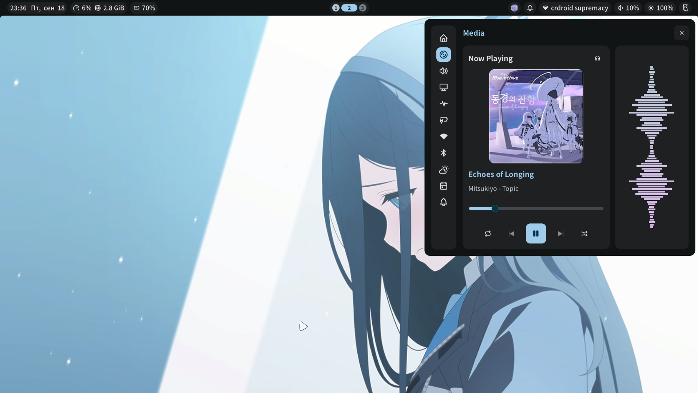
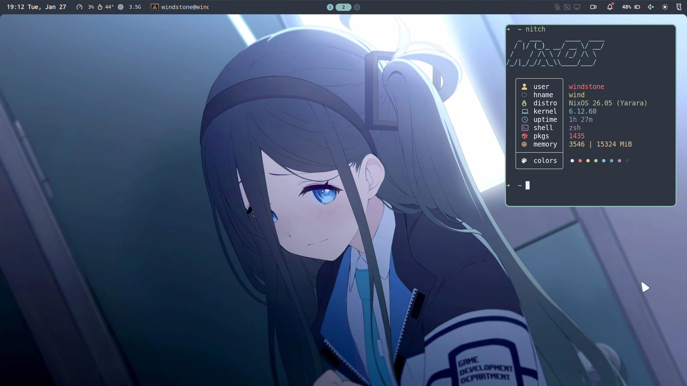

# NixOS & other configurations

## Current

I have changed UI style, updated the kernel, noctalia, and some other packages, and fixed clipboard and some audio issues on my laptop (NMH-WDX9) :3

### Screenshots

### Tools

- Tiling Manager: Niri
- Session: Wayland
- Shell: Noctalia v5
- Terminal: Alacritty
- File Manager: Dolphin & Thunar

## [95f040d](https://github.com/notwindstone/my-nixos/tree/95f040d68fbfa7daef53fb480e94d18bbde2b9ee)

I did not spent more than ten hours on this, yet I still love what results I got with almost zero nix knowledge. Final terms are stopping me from improving this configuration further :c

### Screenshots

### Tools

- Tiling Manager: Niri
- Session: Wayland
- Shell: Noctalia v4
- Terminal: Alacritty
- File Manager: Dolphin & Thunar
